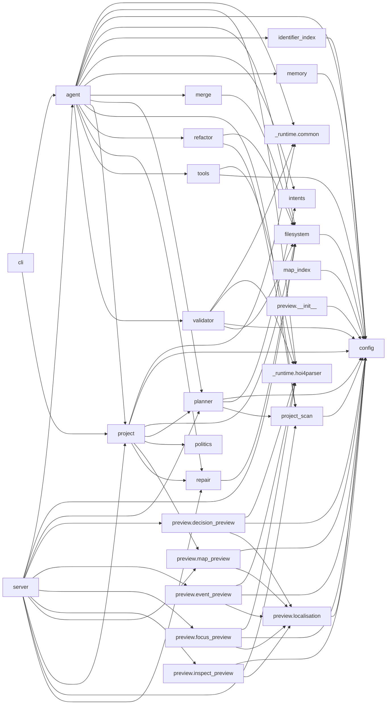

# Dependency Analysis

Static intra-package imports for `hoi4_agent/`. Generated by `devtools/dependency_graph.py`.

## Module coupling

| Module | Depends on (in-package) | Depended on by |
|---|---|---|
| `config` | — | 17 |
| `filesystem` | `config` | 7 |
| `_runtime.hoi4parser` | — | 6 |
| `preview.localisation` | `config` | 5 |
| `project_scan` | `config` | 4 |
| `_runtime.common` | — | 3 |
| `planner` | `config`, `intents`, `project_scan` | 3 |
| `project` | `_runtime.common`, `config`, `filesystem`, `planner`, `politics`, `preview.map_preview`, `repair` | 3 |
| `repair` | `filesystem` | 3 |
| `agent` | `_runtime.common`, `_runtime.hoi4parser`, `config`, `filesystem`, `identifier_index`, `intents`, `memory`, `merge`, `planner`, `project`, `project_scan`, `refactor`, `repair`, `tools`, `validator` | 2 |
| `intents` | — | 2 |
| `preview.map_preview` | `config`, `preview.localisation` | 2 |
| `identifier_index` | `config` | 1 |
| `memory` | `config` | 1 |
| `merge` | `filesystem` | 1 |
| `politics` | — | 1 |
| `preview.decision_preview` | `_runtime.hoi4parser`, `config`, `preview.localisation` | 1 |
| `preview.event_preview` | `_runtime.hoi4parser`, `config`, `preview.localisation` | 1 |
| `preview.focus_preview` | `_runtime.hoi4parser`, `config`, `preview.localisation` | 1 |
| `preview.inspect_preview` | `config`, `preview.localisation` | 1 |
| `refactor` | `filesystem`, `project_scan` | 1 |
| `tools` | `_runtime.hoi4parser`, `config` | 1 |
| `validator` | `_runtime.common`, `_runtime.hoi4parser`, `config`, `filesystem` | 1 |

## Findings

- **Hub modules** (4+ dependents): `config`, `filesystem`, `_runtime.hoi4parser`, `preview.localisation`, `project_scan`. These are the natural integration points; keep their public APIs small.
- **Circular imports**: none detected.
- **Leaf modules** (no in-package deps): `__init__`, `_runtime.__init__`, `_runtime.common`, `_runtime.hoi4parser`, `config`, `intents`, `patcher`, `politics`.

## Recommendations

1. `agent.py` and `project.py` are the biggest hubs. New features should extend the planner task graph + generators, not add branches in `agent.run`.
2. `server.py` should stay a thin facade: RPC handlers delegate to `Agent`/`ProjectExecutor` and never import generators or validators directly.
3. Keep `preview/` free of writes and free of repair/planner imports (currently clean).
4. If a new subsystem needs `IdentifierIndex`-style lookup, depend on `identifier_index.py` (STABLE), never on `data/processed` paths directly.
5. Serialization pairs (`ProjectPlan.to_dict/from_dict`, `Project.to_dict/from_dict`) must stay in sync — a plan-field change touches exactly those two files plus `server.py` when the field is user-supplied.